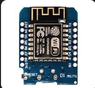
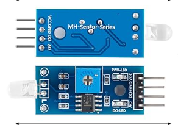
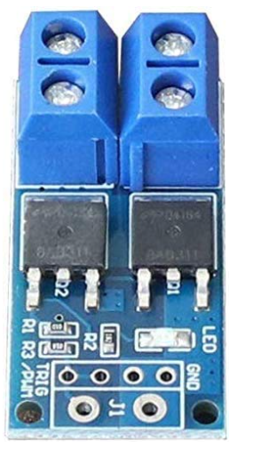
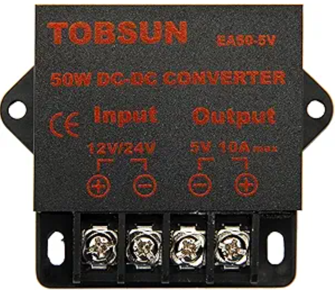

# This Covers the setup of the Baltimore Trash Wheel Orin devices
### Included in this repo are:
- 3d Files for the Orin Enclosure
- Wiring guidelines
- 3d Files for the ring light setup
- Steps to wire the right light
- Steps to program the ring light microcontroller

### Note: The ring light and controller were an exploratory, minimum viable solution. It is what we currently have installed on Gwynnda, and should really be improved. The steps are included here to replicate the setup for posterity. 

## Orin Setup
### Required Materials
- 3d printing filament (PLA and PETG are suitable)
- 4 3x.5mm thread, 4-7mm length heat set inserts
- 4 3x.5x16mm socket head cap screws (6mm head diameter max)
### Printing the Orin enclosure
- Recommended print settings
    - 3 wall layers minimum
    - 3 top and bottom layers minimum
    - 30% infill minimum (recommend gyroid infill)
    - 3mm brim to help adhesion : optional
### Orin power requirements
- The Orin nano dev kit we use comes with an AC adapter, which is the recommended power supply. 
- Usually there is an AC inverter on the trash wheel, inside the control cabinet that you can plug into
- If no adapter is available, the Orin can be powered with a supply between 9-19v DC, but must be able to supply 40 watts. e.g at 9v this is about 4.5 amps, and 19v about 2.2 amps
- The power connector on the Orin is a 5.5 x 2.5mm DC barrel jack
- If not using the AC adapter, use at minimum 18awg stranded copper wire for the power supply, and add an appropriate sized fuse. Automotive fuses are a good choice.
- IF NOT USING THE AC ADAPTER, ENSURE THE POWER SUPPLY YOU ARE USING WILL NOT DEVIATE FROM THE 9-19V RANGE!
- On the barrel jack, Positive(+) goes to the center, Negative(-) is the exterior

# Ring Light Setup 
### Included under the mqtt_ring_light directory, is a platformio project for programming a WemosD1 microcontroller to control an led light via PWM with MQTT.
### Requirements
- [Platformio](https://docs.platformio.org/en/latest/) installed. It is available as a VSCode extension 
- Wemos D1 microcontroller

### Flashing the microcontroller
- Open the mqtt_ring_light directory with Platformio
- Modify the mqtt_ring_light.ino file to match your setup
- You should be able to build/flash the program without any additional setup

# Ring light controller assembly
### All the components were sourced from Amazon, and I have no idea if they will be available in the future, but they seem to be readily available and cheap. We used:
- A wemos D1 mini
    
- A phototransistor module
    
- A PWM controlled mosfet board
    
- A 5v DC-DC converter
    
- A cheap 12 inch ring light
    
