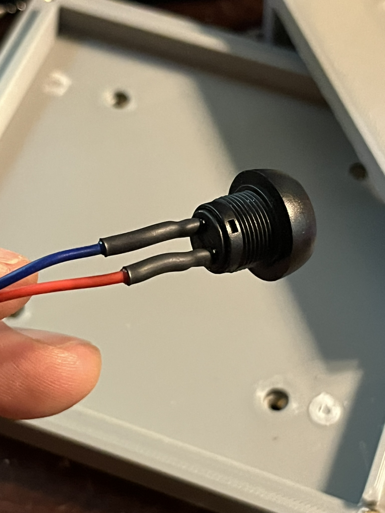
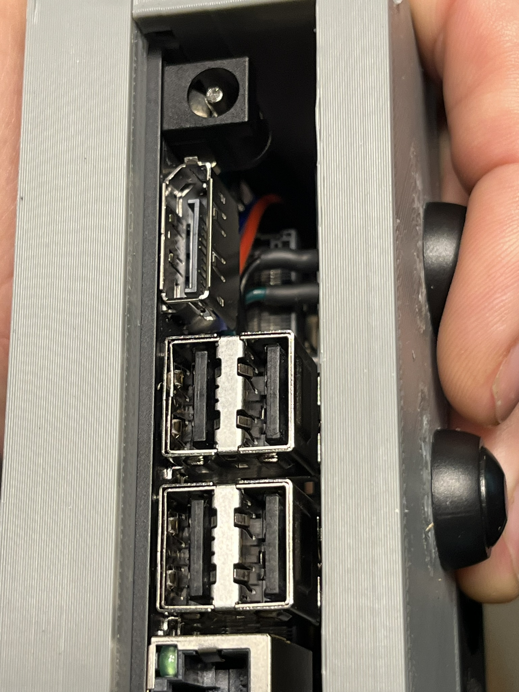

# Jetson Orin Nano Enclosure Assembly Guide

## Introduction
This document provides instructions for assembling the Jetson Orin Nano Enclosure. The enclosure is designed to house the Jetson Orin Nano Developer Kit and provide protection for the board. The enclosure is designed to be used with the Jetson Orin Nano Developer Kit and is not compatible with other versions of the Jetson Nano.
There are two mounting options, hard mounting, or using the included plastic base. The hard mount option requires the use of M2.5 screws and heat set inserts. The hard mount option is recommended for applications where the unit will be subject to vibration or shock, or mounted inverted/vertical, while the plastic base option is recommended for applications where the unit will be stationary and upright.

## Index
- [Required Tools](#required-tools)
- [Required Parts/Materials](#required-partsmaterials)
- [Recommended Print Settings](#recommended-print-settings)
- [Assembly Instructions](#assembly-instructions)
- [Instructions for Hard Mounting](#instructions-for-hard-mounting)
- [Wiring the Momentary Push Button Switches](#wiring-the-momentary-push-button-switches)
- [Installing the Momentary Push Button Switches](#installing-the-momentary-push-button-switches)
- [Final Assembly](#final-assembly)

## Required Tools
- Soldering iron (Highly recommend a temperature controlled iron)
- Solder
- Screwdriver
- Drill
- 1/8 inch (3.125mm) drill bit
- 1/4 inch (6.35mm) drill bit
- Flush cutters (side cutters)
- Needle Nose Pliers
- Heat gun or lighter (for heat shrink tubing, it's really not recommended to use a lighter, but it can be done in a pinch)
- Dupont Connector Crimping Tool
- Wire stripper
- Metric hex keys (Allen wrenches)
- 3D printer
- Sandpaper/file/deburring tool
 
## Required Parts/Materials
- Jetson Orin Nano Enclosure (3D printed)
- 4x M3x20mm socket head or button head screws
- 4x M4x10mm socket head cap screws
- 4x M3x3 heat set inserts (can be up to 4mm long)
- 4x M4x5 heat set inserts (can be up to 7mm long)
- 2x 12mm momentary push button switches
- 1x 2.54mm pitch female pin header jumper
- 4x Dupont Female Crimp Pins
- 2x 1x2 pin 2.54mm pitch Dupont housing 
- ~24 inches (600mm) of 22AWG wire
- Heat shrink tubing (3mm or 1/8 inch diameter 3:1 shrink ratio)
- 4x M2.5x6mm screws (for hard mounting)
- 4x M2.5 heat set inserts (for hard mounting)

# Printing the Enclosure
The enclosure is designed to be 3D printed using a desktop 3D printer in two parts, the top and bottom. PLA is the easiest to use filament, and is why it is recommended for this project. This being the minimal enclosure, it is expected that the unit will be mounted in a safe location away from the elements. These are recommended print settings to produce good results on an Ender 3 printer, but of course, these are merely suggestions and will vary depending on the printer and filament used, use your best judgement.

## Recommended Print Settings 
### The following settings were used with good results on an Ender 3 printer:
- Layers
    - 0.2mm layer height
    - 4 perimeters
    - Initial layer 0.16mm
- Infill
    - Gyroid infill
    - 30% minimum infill
    - 4 solid layers top and bottom
- Supports
    - Base
        - None
    - Top
        - grid pattern
        - 10% density
- Adhesion
    - Top
        - Brim
        - 3mm width
    - Bottom
        - None
- Filament
    - PLA
    - 1.75mm diameter
    - 205C extruder temperature
    - 60C bed temperature
- Cooling
    - 30% fan speed for first three layers
    - 100% fan speed after third layer
- Speed
    - 30mm/s first layer speed
    - 37.5mm/s wall speed
    - 75mm/s print speed
    - 120mm/s travel speed

# Assembly Instructions
## Step 1: Preparing the Enclosure
1.1:
* Remove any support material from the enclosure parts.

1.2:
* Use the deburring tool (or file/sandpaper) to remove any rough edges or burrs from around the edges, and the lip where the two halves meet.

1.3:
* Run the 1/8 inch (3.125mm) drill bit through the holes at the four outside corners on the top and bottom parts, to ensure the holes are clear of any debris, and make sure the 3mm screws slide in freely.

## Step 2: Installing the Heat Set Inserts
2.1: 
* If printed in PLA, set the iron to 220C (~430f), if printed in PETG, set the iron to 230C (~450f), for ASA or ABS, set to 260C.

2.2:
* With the bottom half right side up, Start by inserting the M3 heat set inserts into the four holes around the outside on the bottom part of the enclosure. Place the heat set insert into the hole, and use the soldering iron to heat and push the insert until it is flush with the surface of the part. Repeat this process for all four inserts.

* Use the file or side cutters to remove any excess plastic that may have been pushed up around the insert.

* Note: Be careful to keep the insert as straight as possible, it is easy for the insert to drift sideways and become misaligned.

2.3:
* Repeat the process for the M4x5 heat set inserts in the four holes on the back of the bottom half of the enclosure.

2.4:
* If hard mounting, repeat the process for the M2.5 heat set inserts in the four holes on the bottom of the enclosure, where the Orin mounts.

2.5:
* Test fit the screws into the heat set inserts to ensure they are properly installed, and straight. You can reheat and adjust the inserts if needed.

2.6:
* If there is melted plastic built up behind the thread inserts blocking the bolt, CAREFULLY run the 1/8" drill bit BY HAND, through the back of the holes with inserts, up to the insert, to clear any melted plastic from behind it.

2.7:
* Test fit the top and bottom halfs of the enclosure together, and ensure the screws fit properly into the inserts. If the screws do not fit, check the inserts for any obstructions or debris or misalignment. You can heat and move the inserts if needed.

## Instructions for Hard Mounting
### If you are using the hard mount option, follow these instructions to mount the Orin to the enclosure.
3.1:
* Remove the 4 phillips screws holding the orin nano to the plastic base.

3.2:
* Remove the antennas from the base. You can easily do this by gently bending the plastic base in the center, and pulling at the edge of the antenna where is meets the center of the base.

## Step 3: Wiring the Momentary Push Button Switches
1.1:
* Cut 4x 6 inch (300mm) lengths of 22AWG wire, and strip 1/4 inch (6mm) of insulation from each end.

1.2:
* Using the crimping tool, crimp female dupont pins onto one end of each wire. Be careful not to crimp the section of the pin that will be inserted into the housing. You should be able to see the square section of the pin on the side of the crimping tool. 

note:
* The connector should be gripping the insulation, and the forward section should be crimped onto the wire. The insulation should be flush with the back of the connector.

1.3:
* Slide the crimped pins into the 2 pin dupont housing.

1.4:
* Cut 4 pieces of heat shrink tubing about 3/4 inch (20mm) long.

* tin the other end of the wires, and slide heat shrink tubing over the tinned end.
A video of the tinning process can be found [here](https://www.youtube.com/watch?v=wUfGTLbHFdE)

1.5:
* Tin the button terminals, and solder the wires to the terminals.

1.6:
* Slide the heat shrink tubing over the soldered terminals, and heat to shrink.

## Step 4: Installing the Momentary Push Button Switches
* First, place the female jumper between the auto_on and gnd pins, at the back of the orin nano, under the sd card slot.

4.1:
* Place the momentary push button switches into the holes on the front of the enclosure, and secure them with the included nuts.

4.2:
* Connect the power button connector between the PWR_BTN and GND pins on the Orin Nano.

4.3:
* Connect the reset button connector between the RST_BTN and GND pins on the Orin Nano.

## Step 5: Final Assembly
5.1:
* Place the Orin Nano into the bottom half of the enclosure, and route the wires for the momentary push button switches around the left side of the unit. Making sure that the wires do not get pinched between the enclosure and the Orin unit. The top should seat easily against the bottom half, if it does not, check for pinched wires. 

5.2:
* Secure the top half of the enclosure to the bottom half with the M3x20mm screws.

